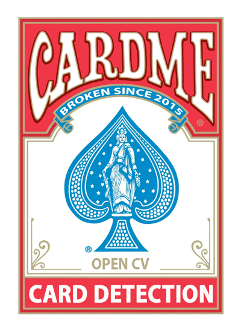
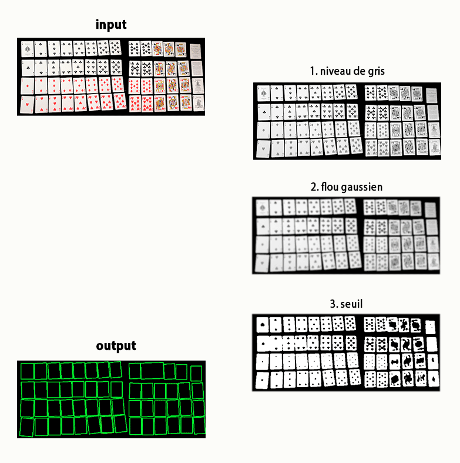
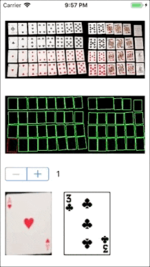

<div align="center">
  
  <h1>Card Me</h1>

  <h4>POC d'intégration d'OpenCV dans une app iOS pour identifier les cartes disposées sur une table.</h4>
  #ios #objective-c #opencv #poc

  <hr/>

</div>

## Objectifs

- [x] Intégrer OpenCV dans une app iOS
- [x] Expérimenter le traitement d'image
- [x] Extraire les cartes d'une photo
- [x] M'occuper un week-end
- [ ] Identifier les cartes de la photo
- [ ] Utiliser l'app sur un jeu de plateau type [7 Wonders](https://www.trictrac.net/jeu-de-societe/7-wonders) pour compter automatiquement les points

## Fonctionnement

### Lister les cartes de la photo

L'idée était de m'appuyer sur la fonction [findContours](https://docs.opencv.org/2.4/modules/imgproc/doc/structural_analysis_and_shape_descriptors.html#findcontours) d'OpenCV.

Il a simplement falut dégrader l'image à travers quelques filtres pour accentuer les contours des cartes.



### Extraction d'une carte

Les contours définis précédement ne sont pas les coordonnées parfaites d'un rectangle (bah ouais). Il a donc fallut :

- faire une [approximation des contours](https://docs.opencv.org/2.4/modules/imgproc/doc/structural_analysis_and_shape_descriptors.html#approxpolydp)

- [déterminer la perspective](https://docs.opencv.org/2.4/modules/imgproc/doc/geometric_transformations.html#getperspectivetransform) de la carte et [appliquer la transformation](https://docs.opencv.org/2.4/modules/imgproc/doc/geometric_transformations.html#warpperspective) nécessaire pour la corriger

- normaliser les dimensions de l'image

### Identification d'une carte

Le projet contient [52 cartes de références](CardMe/deck) auxquels on compare celle que l'on cherche à identifier en attribuant un [score de similarité PSNR](https://docs.opencv.org/2.4/doc/tutorials/highgui/video-input-psnr-ssim/video-input-psnr-ssim.html#videoinputpsnrmssim)

Le score le plus bas correspond à l'image la plus ressemblante.

## Conclusion

... parfois, ça marche un peu :-D

<div align="center">
  
</div>

- **L'intégration d'OpenCV** n'a pas posé de problème particulier (POD 4 Ever ♥). En revanche OpenCV est en C: Hello pointers; Cio Foundation.

- **L'extraction de cartes** ne supporte pas du tout la supperposition avec d'autre éléments; la détection de contours est gênée par les sigles ♥ ♦ ♣ ♠ La fonction Distance Transform utilisée sur [ce tuto](https://docs.opencv.org/3.3.0/d2/dbd/tutorial_distance_transform.html) serait parfaite pour corriger tout ça.

- **L'identification d'une carte** est un gros échec :-) Je pense malgré tout que l'idée de score est bonne et qu'en insistant un peu ça finirait par marcher.


## Installation
```
# clone repo
git clone git@github.com:ericdesa/cardme-ios.git

# install pico2wave pour la synthèse vocale
pod install
```

## Ressources
- https://docs.opencv.org/2.4/
- https://docs.opencv.org/2.4/doc/tutorials/highgui/video-input-psnr-ssim/video-input-psnr-ssim.html#videoinputpsnrmssim
- https://docs.opencv.org/3.3.0/d2/dbd/tutorial_distance_transform.html
